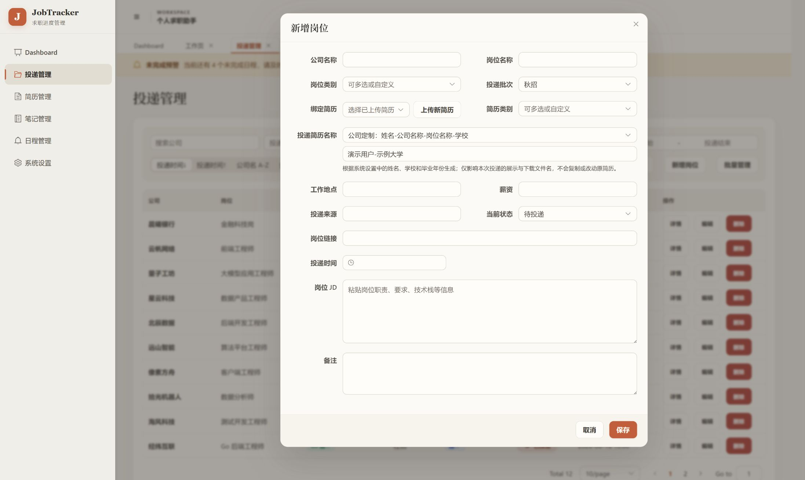

<p align="center">
  
</p>

<p align="center">
  <strong>Windows 10 / 11</strong> · Vue 3 · Spring Boot 3 · Electron · H2 · v1.2.2
</p>

<p align="center">
  <a href="#快速下载和使用">快速下载和使用</a> ·
  <a href="#界面导览">界面导览</a> ·
  <a href="#完整工作流">完整工作流</a> ·
  <a href="#本地运行">本地运行</a> ·
  <a href="#数据与备份">数据与备份</a> ·
  <a href="./END_USER_MANUAL.md">用户手册</a>
</p>

JobTracker Desktop（个人求职助手）是一款面向长期求职跟进的本地桌面工具。它把岗位投递、招聘流程、简历版本、面试复盘、笔记资料与日程提醒放进同一个工作台，让每条记录都能回答四个问题：**投了什么、进展如何、用了哪份简历、下一步是什么。**

应用与数据默认在本机运行，不要求远程账号，也不依赖云端业务服务。

## 快速下载和使用

不想配置开发环境？直接下载安装包即可使用，无需安装 Java 或 Node。

### 下载

前往 [Releases 页面](https://github.com/jiangnan0623/jobtracker-desktop/releases) 获取最新版本。每个版本提供两个 Windows 安装包：

| 安装包 | 大小 | 适合谁 |
| --- | --- | --- |
| `个人求职助手 Setup x.y.z-full.exe` | 较大 | 希望安装后直接使用，**无需本机安装 Java**（内置裁剪后的运行时） |
| `个人求职助手 Setup x.y.z-lite.exe` | 较小 | 本机已安装 Java 17，希望安装包更轻便 |

> 同名 `.blockmap` 文件是自动更新用的增量索引，**不用下载**，忽略即可。

### 安装与启动

1. 双击下载的 `.exe` 安装程序，按 NSIS 向导完成安装。
2. 通过开始菜单或桌面快捷方式启动「个人求职助手」。
3. 首次启动会自动在 `%APPDATA%\个人求职助手\` 创建本地数据库与文件目录，开箱即用。

### 数据与备份

所有数据（岗位、简历、笔记、日程）都保存在你本机，默认位于：

```text
%APPDATA%\个人求职助手\
```

建议定期备份该目录下的 `jobtracker.mv.db`、`resumes\`、`interview_notes\`、`notes\`。完整迁移步骤见[最终用户使用说明](./END_USER_MANUAL.md#十二换电脑怎么办)。

## 一眼掌握全局

<p align="center">
  
</p>

Dashboard 把投递总量、面试与 Offer、状态分布、趋势、公司统计和今日待办集中在第一屏。状态不是孤立标签：点击日程或投递记录即可继续进入对应岗位上下文。

> 所有截图均来自当前版本的隔离演示环境；姓名、学校、届别、公司、岗位和目录均为虚构或通用示例。

## 界面导览

### 投递管理：让岗位清单始终可扫描

<p align="center">
  
</p>

- 按公司、状态、岗位类别、批次、简历类别和时间范围组合筛选。
- 支持投递时间与公司排序、同公司合并、自定义选项和批量管理。
- 在列表中直接查看状态、投递时间，并进入详情或继续编辑。

<details>
<summary><strong>查看新增岗位与简历命名</strong></summary>

<br>

<p align="center">
  
</p>

新增岗位时可以绑定已有简历或上传新版本，并根据姓名、公司、岗位、学校等字段生成投递专用文件名；生成结果只影响展示和下载名称，不会改动原始简历。

</details>

### 岗位详情：一条投递拥有完整上下文

<p align="center">
  
</p>

- 维护岗位信息、Markdown JD、链接、备注和实际绑定的简历版本。
- 自定义招聘节点，为每一步记录结果与操作时间；Offer 与淘汰作为明确终态。
- 关联笔试、面试、复盘与截止日程，并保存面试记录和 Markdown 复盘笔记。

### 简历管理：知道每个版本用在了哪里

<p align="center">
  
</p>

上传、预览、下载、编辑和删除 PDF / Word 简历；按类别管理不同方向版本，并展开查看每份简历绑定的岗位和对应投递名称。

### 笔记管理：资料、清单与复盘统一归档

<p align="center">
  
</p>

支持嵌套文件夹、拖拽移动与移回根目录；可以新建或上传 Markdown、TXT、PDF、Word，预览常用格式并编辑文本内容。

### 日程管理：把下一步真正排进时间表

<p align="center">
  
</p>

月、周、日、列表四种视图覆盖不同节奏；日程可设置类型、优先级、重要程度和状态，并与具体投递双向关联。全局未完成预警会持续提示仍需处理的事项。

### 系统设置：文件放哪里、简历叫什么，都由你决定

<p align="center">
  
</p>

分别配置简历、面试笔记和普通笔记目录；维护默认命名信息、预设规则与可复用的自定义模板。截图中的 `D:\JobTrackerData` 仅为通用演示路径。

## 完整工作流

<p align="center">
  
</p>

一次投递不再散落在表格、文件夹和日历中：岗位是主线，简历、流程、日程、面试与笔记都回到同一条记录。

## 本地优先

```text
Vue 3 界面
    │
    └── 本地 Spring Boot 服务
            │
            ├── H2 本地数据库
            └── 简历、面试笔记与普通笔记文件
```

- 不需要注册账号，也不需要部署 MySQL 或业务服务器。
- H2 数据库、简历、面试笔记和普通笔记都由用户自己的电脑保存。
- 三类文件目录可分别配置，方便纳入现有备份或同步方案。

## 本地运行

### 环境要求

- Windows 10 / 11
- Java 17 JDK
- Maven 3.9+
- Node.js 22 与 npm

### 开发模式

启动后端：

```powershell
cd backend
mvn spring-boot:run
```

另开一个终端启动前端：

```powershell
cd frontend
npm.cmd install
npm.cmd run dev
```

前端默认位于 `http://localhost:5173`，后端默认位于 `http://localhost:8080`。

### 构建 Windows 安装包

在JobTrackerDesktop/desktop目录下执行：

```powershell
npm run dist:full
npm run dist:lite
```

| 构建 | 适合谁 | Java 运行时 |
| --- | --- | --- |
| **Lite** | 已安装 Java 17，希望安装包更小 | 不附带 |
| **Full** | 希望安装后直接使用 | 附带裁剪后的运行时 |

安装包版本读取自 `desktop/package.json`。推送涉及 `backend/`、`frontend/`、`desktop/` 或构建工作流的变更到 `main` 后，[GitHub Actions](./.github/workflows/build-desktop.yml) 会构建两种 Windows 安装包。

## 数据与备份

默认数据目录位于：

```text
%APPDATA%\个人求职助手\
```

建议定期备份：

```text
jobtracker.mv.db
resumes\
interview_notes\
notes\
storage.properties
```

如果修改过文件保存目录，也需要一并备份新目录。完整迁移步骤见[用户使用说明](./END_USER_MANUAL.md#十二换电脑怎么办)。

## 使用边界

- 当前面向 Windows 本地使用场景。
- PDF 和 Word 支持预览与管理，不支持直接编辑正文。
- 修改保存位置只影响之后创建或上传的文件，不会自动迁移已有文件。
- 删除文件夹会同时删除子项目，请先确认并做好备份。
- 日程只有明确绑定到投递记录后，才会出现在对应岗位详情中。

## 项目结构

```text
JobTrackerDesktop/
├── frontend/       Vue 3 + TypeScript 界面
├── backend/        Spring Boot 服务与 H2 数据访问
├── desktop/        Electron 外壳与 Windows 打包脚本
├── database/       数据库脚本与迁移
└── END_USER_MANUAL.md
```

## 技术栈

- **前端**：Vue 3、TypeScript、Vite、Element Plus、ECharts
- **后端**：Java 17、Spring Boot 3、MyBatis Plus
- **桌面端**：Electron、electron-builder、NSIS
- **本地存储**：H2 与本地文件系统

## 文档与许可

- [最终用户使用说明](./END_USER_MANUAL.md)
- [MIT License](./LICENSE)
