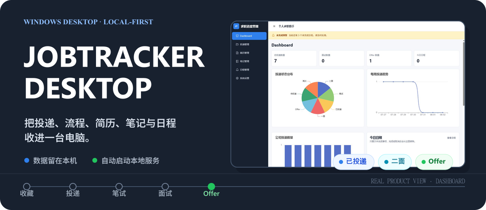
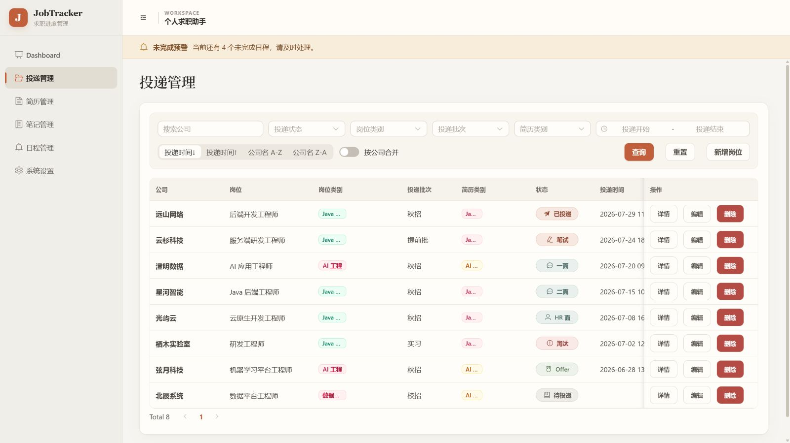
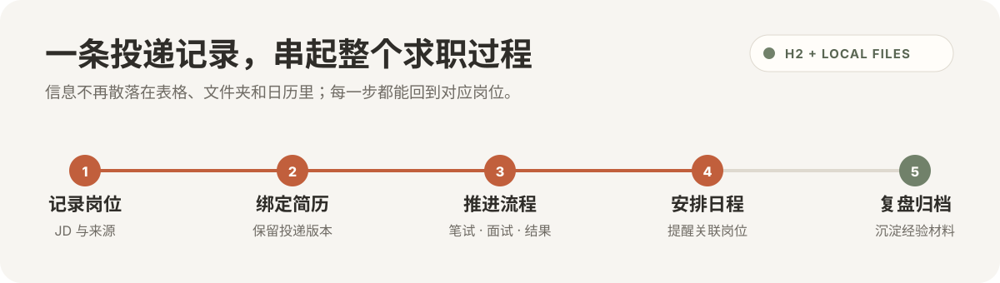
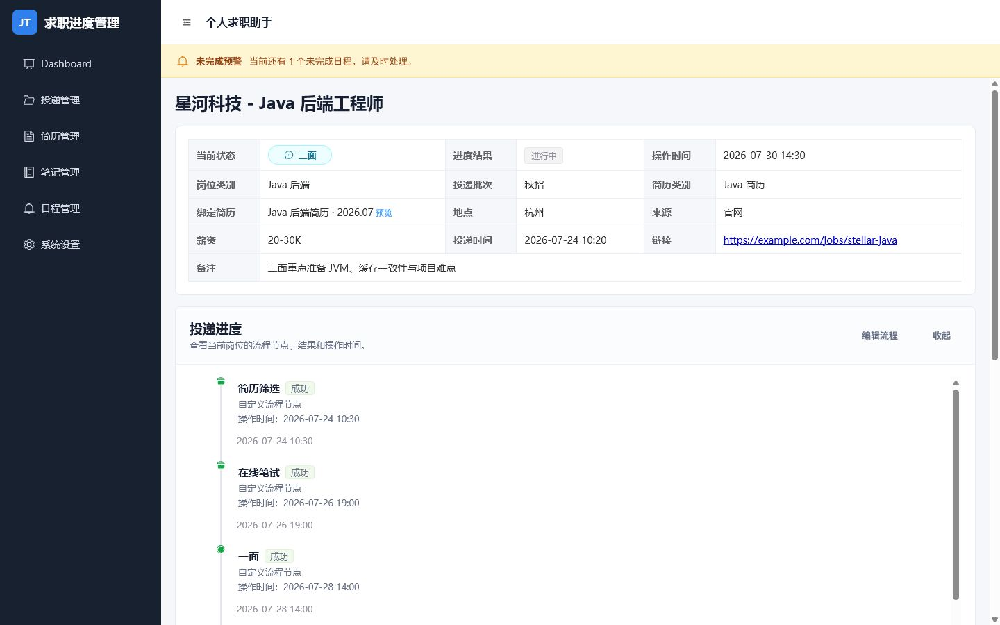
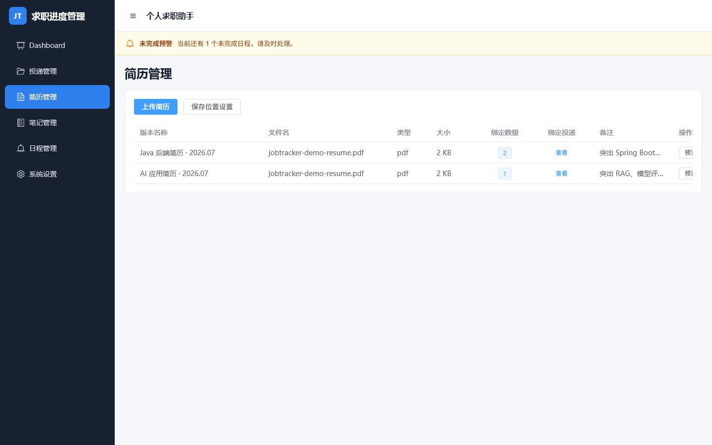
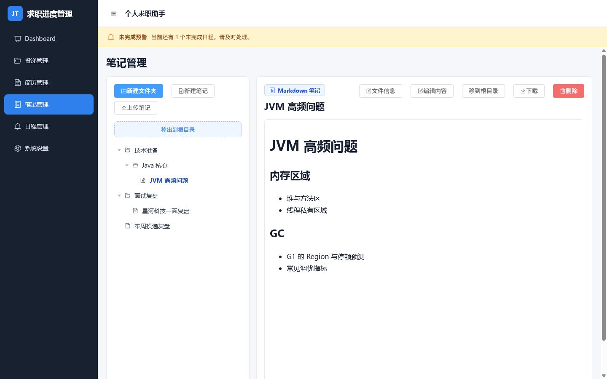
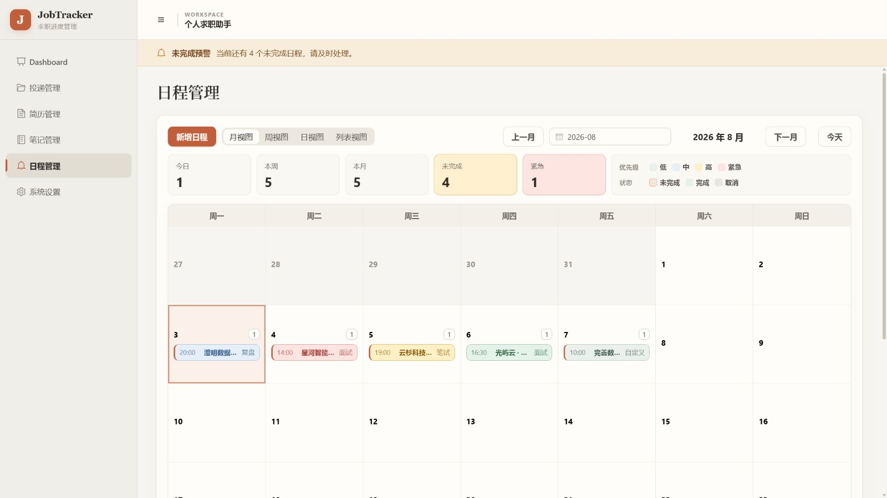
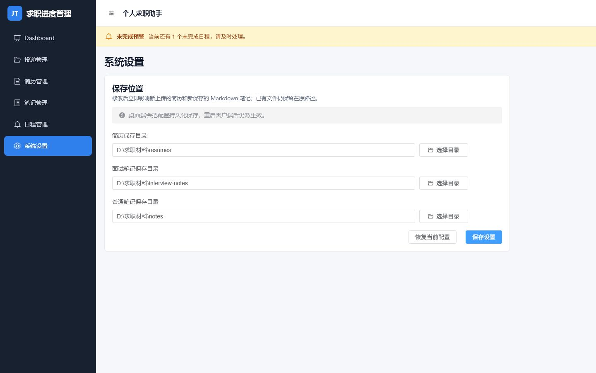

<p align="center">
  
</p>

<p align="center">
  <strong>Windows 10 / 11</strong> · Vue 3 · Spring Boot 3 · H2
</p>

<p align="center">
  <a href="#功能展示">功能展示</a> ·
  <a href="#本地运行">本地运行</a> ·
  <a href="#数据与备份">数据与备份</a> ·
  <a href="./END_USER_MANUAL.md">用户手册</a>
</p>

JobTracker Desktop（个人求职助手）是一款本地优先的求职进度管理工具。它把岗位投递、招聘流程、简历版本、面试记录、笔记资料和日程提醒放进同一个工作台，帮助你随时回答：

- 投了哪些公司和岗位？
- 每条投递进行到哪一步？
- 当时使用的是哪份简历？
- 下一场笔试、面试或截止事项是什么时候？

适用于秋招、春招、实习、提前批、社招、国企、银行、研究所等需要长期跟踪多条投递的场景。应用在本机运行，数据默认不会主动上传到远程服务器。

## 功能展示

### 从投递清单，到完整求职上下文

<p align="center">
  
</p>

> 截图使用演示数据，不包含真实个人求职信息。

筛选、排序和状态标签让投递台账保持可扫描；同一公司的多个岗位也可以合并查看。进入岗位详情后，每条投递都会展开成一份持续更新的求职档案。

<p align="center">
  
</p>

### 每个岗位都有自己的详情页

<p align="center">
  
</p>

详情页把岗位信息和后续行动放在同一处：

- 维护当前状态、自定义招聘流程、节点结果和操作时间。
- 查看实际绑定的简历版本、Markdown JD、岗位链接与备注。
- 关联笔试、面试、复盘和截止日程。
- 记录面试问题、难度、结果与 Markdown 复盘笔记。
- 按需收起各个区域，长流程也能保持清晰。

### 追踪每一版简历

<p align="center">
  
</p>

简历不再只是一个文件名。每个版本都可以维护用途和备注，并查看它被哪些岗位实际使用。新增投递时既可以绑定已有简历，也可以临时上传并自动关联。

### 建立自己的求职知识库

<p align="center">
  
</p>

笔记管理像一个轻量文件工作区：支持嵌套文件夹、拖拽移动、Markdown 与 TXT 编辑，以及 PDF、Word 文件预览。技术准备、公司调研和面试复盘可以分别归档，需要时直接在应用内查看。

### 把下一步放进日历

<p align="center">
  
</p>

日程可以设置起止时间、优先级、重要程度和关联投递，并在月、周、日和列表视图之间切换。未完成事项会持续提醒；完成或取消后，它们会自动离开待处理列表。

### 数据放在哪里，由你决定

<p align="center">
  
</p>

简历、面试笔记和普通笔记可以分别指定本地目录。设置会持久化保存，新创建的文件会进入对应位置，方便纳入你自己的备份和同步习惯。

## 核心能力

- **投递管理**：记录公司、岗位、批次、来源、地点、薪资、JD 和备注，支持组合筛选、自定义状态、排序与按公司合并。
- **招聘流程**：为每个岗位维护独立流程，用时间轴记录节点、结果和操作时间，并处理 Offer 与淘汰等最终状态。
- **简历版本**：上传、预览、下载和维护不同版本的简历，同时追踪每个版本的实际投递用途。
- **面试与复盘**：记录轮次、时间、面试官、问题、难度和结果，并保存 Markdown 面试笔记。
- **笔记资料**：组织文件夹、Markdown、TXT、PDF 和 Word 资料，支持预览、移动与下载。
- **日程联动**：管理笔试、面试、复盘与截止日期，并把事项关联回具体岗位。
- **全局概览**：查看投递总量、状态分布、每周趋势、公司统计、最近投递和未完成日程预警。

## 本地运行

当前仓库提供前端、后端和数据库相关源码。

环境要求：

- Windows 10 / 11
- Java 17 JDK
- Maven 3.9+
- Node.js 与 npm

启动后端：

```powershell
cd backend
mvn spring-boot:run
```

在另一个终端启动前端：

```powershell
cd frontend
npm.cmd install
npm.cmd run dev
```

开发页面默认位于 `http://localhost:5173`，后端默认位于 `http://localhost:8080`。

## 工作方式

```text
Vue 3 界面
    │
    └── 本地 Spring Boot 服务
            │
            ├── H2 本地数据库
            └── 简历、面试笔记与普通笔记文件
```

界面、服务、数据库和文件都在本机工作，不需要配置远程服务器或 MySQL。

## 数据与备份

默认数据目录通常位于：

```text
C:\Users\你的用户名\AppData\Roaming\个人求职助手\
```

建议定期备份：

```text
jobtracker.mv.db
resumes\
interview_notes\
notes\
storage.properties
```

如果在系统设置中修改过保存目录，也需要一并备份对应目录。完整的迁移步骤见 [用户使用说明](./END_USER_MANUAL.md#十二换电脑怎么办)。

## 使用边界

- 当前产品面向 Windows 本地使用场景。
- PDF 和 Word 文件支持预览与管理，不支持直接编辑正文。
- 修改文件保存位置只影响之后创建或上传的文件，不会自动迁移已有文件。
- 删除文件夹会同时删除其子项目，请在操作前确认并做好备份。
- 日程只有明确绑定到投递记录后，才会出现在对应岗位详情中。

## 项目结构

```text
JobTrackerDesktop/
├── backend/        Spring Boot 后端与 H2 数据访问
├── frontend/       Vue 3 前端界面
├── database/       数据库脚本与迁移
└── END_USER_MANUAL.md
```

## 技术栈

- **前端**：Vue 3、TypeScript、Vite、Element Plus、ECharts
- **后端**：Java 17、Spring Boot 3、MyBatis Plus
- **本地存储**：H2 与本地文件系统

## 文档

- [最终用户使用说明](./END_USER_MANUAL.md)
- [MIT License](./LICENSE)

## License

本项目基于 [MIT License](./LICENSE) 开源。
