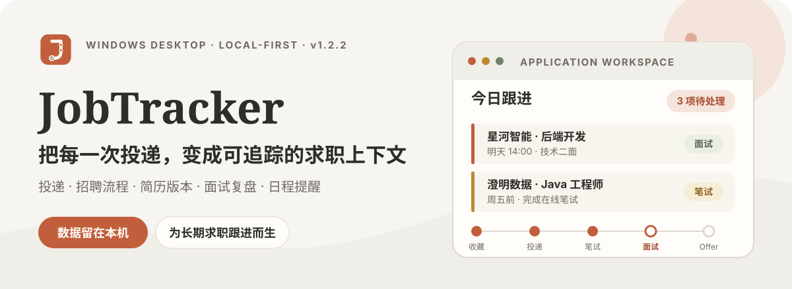
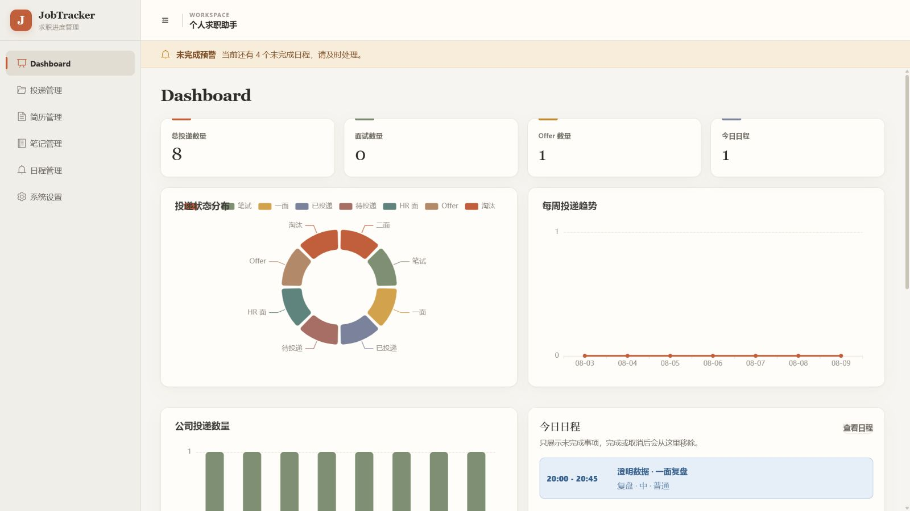

<p align="center">
  
</p>

<p align="center">
  <strong>Windows 10 / 11</strong> · Vue 3 · Spring Boot 3 · H2 · 当前桌面包版本 1.2.1
</p>

<p align="center">
  <a href="#实际界面">实际界面</a> ·
  <a href="#核心能力">核心能力</a> ·
  <a href="#本地运行">本地运行</a> ·
  <a href="#数据与备份">数据与备份</a> ·
  <a href="./END_USER_MANUAL.md">用户手册</a>
</p>

JobTracker Desktop（个人求职助手）是一款面向长期求职跟进的本地桌面工具。它把岗位投递、招聘流程、简历版本、面试复盘、笔记资料和日程提醒放进同一个工作台，让每条记录都能回答四个问题：**投了什么、进展如何、用了哪份简历、下一步是什么。**

适用于秋招、春招、实习、提前批、社招、国企、银行和研究所等需要同时跟踪多条流程的场景。应用与数据默认都在本机工作，不依赖远程账号或云端服务。

## 实际界面

### 一个视图掌握全局

<p align="center">
  
</p>

Dashboard 汇总投递总量、状态分布、每周趋势、公司统计和待办提醒，打开应用后先看全局，再决定今天最需要推进的事项。

### 先看全局，再处理下一步

<p align="center">
  
</p>

> 截图使用演示数据，不包含真实个人求职信息。

投递列表负责保持全局可扫描：组合筛选、自定义状态、排序和按公司合并可以快速收拢视线；点进任一岗位后，信息会继续展开为一份完整、持续更新的求职档案。

<p align="center">
  
</p>

### 每个岗位都有自己的上下文

<p align="center">
  
</p>

在岗位详情中，可以维护当前状态与自定义招聘节点，查看实际绑定的简历版本，保存 Markdown JD、岗位链接和备注，并关联笔试、面试、复盘与截止日程。长流程中的每一次操作都能留在对应岗位下。

<details>
<summary><strong>展开更多工作区截图</strong></summary>

#### 简历版本

<p align="center">
  
</p>

#### 求职笔记

<p align="center">
  
</p>

#### 日程提醒

<p align="center">
  
</p>

</details>

## 核心能力

| 工作区 | 解决的问题 |
| --- | --- |
| **投递管理** | 记录公司、岗位、批次、来源、地点、薪资、JD 和备注；支持筛选、排序、公司合并与自定义状态。 |
| **招聘流程** | 为每个岗位维护独立流程，用时间轴记录节点、结果和操作时间。 |
| **简历版本** | 上传、预览、下载并维护不同版本，同时追踪每份简历的实际投递用途。 |
| **面试复盘** | 记录轮次、时间、面试官、问题、难度和结果，保存 Markdown 复盘笔记。 |
| **笔记资料** | 组织嵌套文件夹、Markdown、TXT、PDF 和 Word 资料，支持预览、移动与下载。 |
| **日程联动** | 管理笔试、面试、复盘与截止日期，并把事项关联回具体岗位。 |
| **全局概览** | 查看投递总量、状态分布、每周趋势、公司统计、最近投递和待办预警。 |

## 本地优先

```text
Vue 3 界面
    │
    └── 本地 Spring Boot 服务
            │
            ├── H2 本地数据库
            └── 简历、面试笔记与普通笔记文件
```

- 不需要注册远程账号，也不需要部署 MySQL 或业务服务器。
- 简历、面试笔记和普通笔记可以分别设置本地目录。
- 数据库与文件目录可以直接纳入自己的备份或同步方案。

## 本地运行

### 环境要求

- Windows 10 / 11
- Java 17 JDK
- Maven 3.9+
- Node.js 22 与 npm

### 开发模式

启动后端：

```powershell
cd backend
mvn spring-boot:run
```

在另一个终端启动前端：

```powershell
cd frontend
npm.cmd install
npm.cmd run dev
```

前端默认位于 `http://localhost:5173`，后端默认位于 `http://localhost:8080`。

### 构建 Windows 安装包

```powershell
desktop/build-desktop-lite.ps1 -Maven mvn.cmd -Jlink jlink.exe
desktop/build-desktop-full.ps1 -Maven mvn.cmd -Jlink jlink.exe
```

- **Lite**：不附带 Java 运行时，安装包更小，目标电脑需已有 Java 17。
- **Full**：附带裁剪后的 Java 运行时，开箱即用。
- 安装包版本读取自 `desktop/package.json`；当前配置会生成 `1.2.1` 版本的 Lite / Full 安装包。
- 推送涉及 `backend/`、`frontend/`、`desktop/` 或构建工作流的变更到 `main` 后，GitHub Actions 会自动构建两种 Windows 安装包。

## 数据与备份

默认数据目录通常位于：

```text
C:\Users\你的用户名\AppData\Roaming\个人求职助手\
```

建议定期备份：

```text
jobtracker.mv.db
resumes\
interview_notes\
notes\
storage.properties
```

如果在系统设置中修改过保存目录，也需要一并备份对应目录。完整迁移步骤见 [用户使用说明](./END_USER_MANUAL.md#十二换电脑怎么办)。

## 使用边界

- 当前产品面向 Windows 本地使用场景。
- PDF 和 Word 文件支持预览与管理，不支持直接编辑正文。
- 修改文件保存位置只影响之后创建或上传的文件，不会自动迁移已有文件。
- 删除文件夹会同时删除其子项目，请在操作前确认并做好备份。
- 日程只有明确绑定到投递记录后，才会出现在对应岗位详情中。

## 项目结构

```text
JobTrackerDesktop/
├── frontend/       Vue 3 前端界面
├── backend/        Spring Boot 服务与 H2 数据访问
├── desktop/        Electron 外壳与 Windows 打包脚本
├── database/       数据库脚本与迁移
└── END_USER_MANUAL.md
```

## 技术栈

- **前端**：Vue 3、TypeScript、Vite、Element Plus、ECharts
- **后端**：Java 17、Spring Boot 3、MyBatis Plus
- **桌面端**：Electron、electron-builder、NSIS
- **本地存储**：H2 与本地文件系统

## 文档与许可

- [最终用户使用说明](./END_USER_MANUAL.md)
- [MIT License](./LICENSE)
